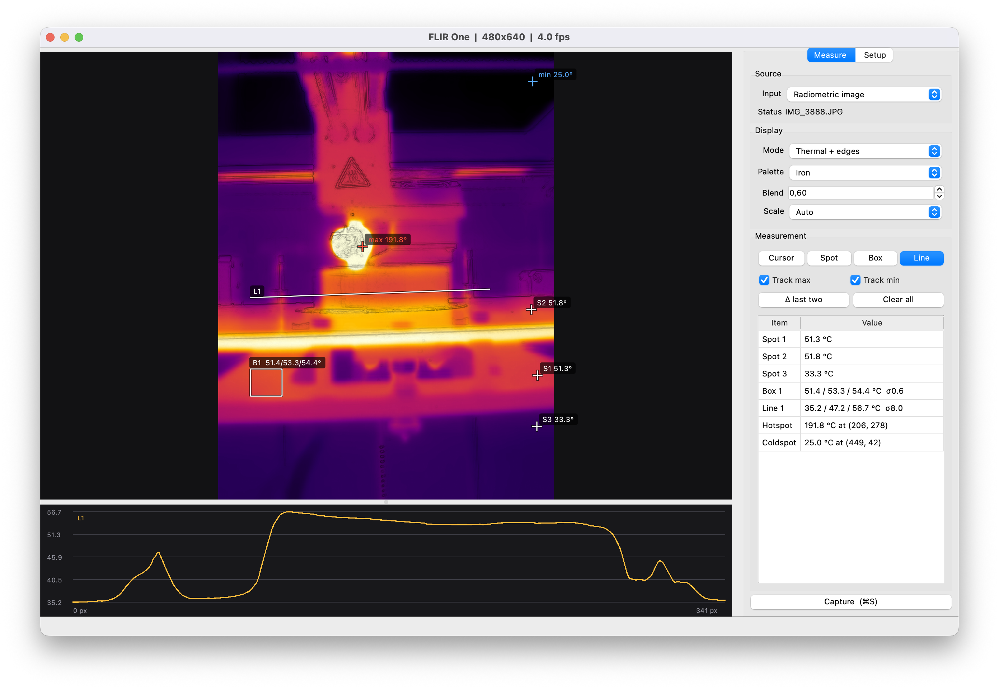
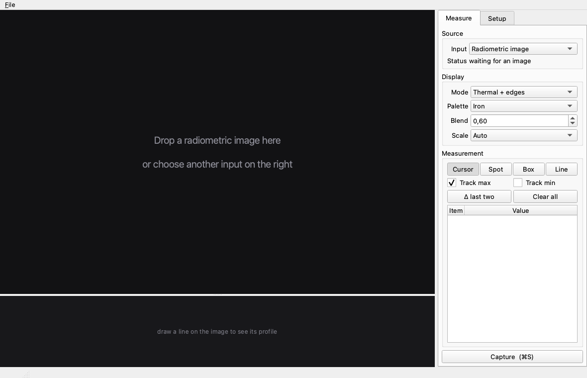
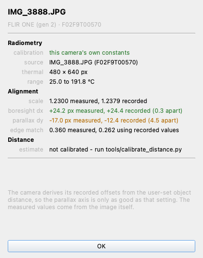
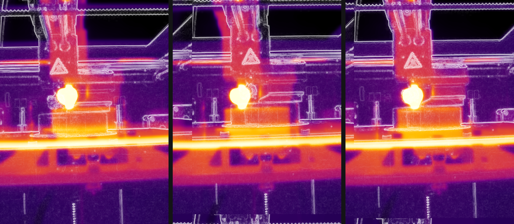

# flirone-mac

macOS viewer and radiometric measurement tool for the FLIR One thermal camera.

Live dual-mode preview (thermal + visible), spot/box/line measurements with
emissivity and atmospheric correction, and captures that can be reprocessed
later.



Spot, box and line measurements over a radiometric image, with the line profile
plotted beneath and every reading in absolute degrees. Conditions, alignment and
calibration live on the Setup tab.

## Status

The USB layer is solved and the application is complete and testable against
synthetic and recorded frames.

**Live streaming from a Lightning (iOS) FLIR One does not work yet.** The iAP2
accessory handshake is implemented and the camera authenticates successfully,
but it resets when asked to open its video session. The hardware is fine: it
streams from the official iOS app through the same adapter. See
[docs/hardware-findings.md](docs/hardware-findings.md) for the full trace and the
list of eliminated causes.

The Android/USB-C variant speaks the documented vendor protocol with no iAP
layer and should work with this driver as written, though that is untested for
want of the hardware.

**Radiometric images shot with the phone app work today.** File > Open
radiometric image loads the raw 16-bit thermal plane along with this camera's
own Planck constants and the conditions of the shot, so every measurement tool
runs properly calibrated.

## Install

### macOS

```bash
brew install exiftool libusb
uv venv --python 3.12
uv pip install -e .
```

Two external tools are needed, for different halves of the application:

- **exiftool** reads FLIR's APP1 metadata: the camera's calibration, the
  conditions of the shot and the raw thermal plane. Without it, radiometric
  images cannot be opened at all. It is the only reliable reader for that
  layout, which is why it is shelled out to rather than reimplemented.
- **libusb** drives the camera over USB. Without it, files still work and only
  live capture is unavailable.

Both are located by absolute path rather than through `PATH`, so they are still
found from an app bundle launched by Finder, which inherits no shell
environment. 

### Linux

Everything runs on Linux, interface included. Development and release testing
happen on macOS, and only live capture is unavailable, for the reason in the
Status section rather than anything platform-specific.

```bash
sudo apt install libimage-exiftool-perl libusb-1.0-0
uv sync
```

Two host settings are needed before the camera will enumerate at all.

**Switch USB enumeration to the old scheme.** Under Linux's default the camera
answers the first descriptor request and then leaves the bus during the second
port reset, so it never receives an address and re-attaches about once a second
forever:

```bash
echo 1 | sudo tee /sys/module/usbcore/parameters/old_scheme_first
```

Make it permanent by adding `usbcore.old_scheme_first=1` to
`GRUB_CMDLINE_LINUX_DEFAULT` in `/etc/default/grub`, then `sudo update-grub`.
The setting is global and safe to carry: it was the kernel's own default
historically, and `use_both_schemes` keeps the new scheme as a fallback.

**Add a udev rule**, or pyusb can only claim the camera as root:

```bash
sudo tee /etc/udev/rules.d/99-flirone.rules >/dev/null <<'EOF'
SUBSYSTEM=="usb", ATTR{idVendor}=="09cb", MODE="0660", GROUP="plugdev", TAG+="uaccess"
EOF
sudo udevadm control --reload-rules
sudo udevadm trigger --subsystem-match=usb
```

Your user has to be in `plugdev`. `ATTR{idVendor}` is lowercase hex with no
`0x`; `0x09CB` matches nothing and fails silently.

Section 12 of [docs/hardware-findings.md](docs/hardware-findings.md) has the
usbmon trace behind both.

## Run

```bash
uv run flirone
```



It opens waiting for an image. Drop one on the window, on the Dock icon, or pass
it on the command line.

### macOS

Or build a double-clickable bundle:

```bash
./tools/make_app.sh
```

### Linux

`uv run flirone` is enough. There is no dedicated build for Linux yet.

Qt ships its own platform plugins inside the venv, so nothing is needed beyond
the two packages above.

## Calibration

The camera streams sensor counts, not temperatures. Converting them needs the
Planck constants, which are **per unit** and are not carried in the USB stream.
Until you load them the app runs with a reference camera's constants, marks
itself UNCALIBRATED, and shows readings in orange: those are usable for relative
thermography and must not be quoted as absolute temperatures.

To calibrate, shoot one image with the FLIR One phone app and load it via
*File > Load calibration from radiometric JPEG*. The constants are read straight
out of the FLIR APP1 segment (exiftool is used as a fallback).

## Radiometric images

Open a JPEG shot with the FLIR One phone app by dropping it on the window,
dropping it on the Dock icon, passing it on the command line, or `File > Open
radiometric image` (Ctrl+O, ⌘O on macOS). Unlike the live stream, these carry
the camera's own calibration, so readings are absolute rather than relative.
Emissivity, reflected apparent temperature, humidity and distance are read from
the file and can then be adjusted, and the whole field is recomputed.

The raw plane's byte order is resolved by physical plausibility rather than
assumption: both orders are converted to temperature and scored against the
camera's own stated measurement range. Verified against a FLIR One Gen 2 file,
where the correct order is 172x smoother and puts 99.4% of pixels in range.

Auto scaling clips to the 1st-99th percentile. A few saturated pixels otherwise
consume most of the palette and flatten the scene; "Full range" gives true
min/max if you want it.

Drops also accept a saved calibration (`.json`) and a folder of captures, which
starts replaying it. Dropping a calibration together with an image applies the
calibration first.

## Alignment and distance

The visible and thermal cameras sit a few millimetres apart, so the visible
image must be scaled and shifted onto the thermal one.

Radiometric JPEGs record the alignment the camera used (`Real2IR`, `OffsetX`,
`OffsetY`). Those offsets are in **visible-image pixels** and signed opposite to
this code's convention, so they need dividing by the visible-to-thermal grid
ratio and negating. Read correctly they are good, and the app applies them the
moment an image is opened.

They are not the whole story, though. The camera derives them from the
**user-set object distance**, usually left at its 1 m default. The two lenses
sit side by side, which in portrait is the image's vertical axis, so:

- `dx` is the fixed boresight offset and does not depend on distance
- `dy` carries the parallax and is only as good as the distance setting

`Auto-align from edges` measures both from the image. The two images share
almost no intensity relationship but do share structure, so registration runs on
gradient magnitude: phase correlation for translation, swept over scale,
selected by normalised cross-correlation. It runs automatically on import and
the result is reported on a summary card.



The card sets what the file recorded against what was measured from it, so
the two can be compared rather than silently merged.



Left: no offset. Middle: the offsets the camera recorded. Right: recovered from
edges. Watch the warning triangle and the glowing blob, where only the right
panel puts the visible edges on the thermal features.

Measured on a FLIR One Gen 2 frame:

| quantity | recorded | measured | agreement |
|---|---|---|---|
| scale | 1.2379 | 1.2300 | 0.6% |
| boresight `dx` | +24.44 px | +24.15 px | **0.29 px** |
| parallax `dy` | −12.44 px | −16.99 px | 4.54 px |

Edge cross-correlation improves from 0.262 using the recorded values to 0.360
using the measured ones. The boresight axis agreeing to a third of a pixel is
what says the method works; the parallax axis disagreeing by 4.5 px is the 1 m
assumption being wrong for this scene.

### Distance

Parallax carries distance: `dx(Z) = dx_inf + K/Z`, where `dx_inf` is the offset
at infinity and `K = f * baseline`. A single image cannot give `Z`, because one
measured offset has two unknowns behind it. Two shots at accurately known
distances fix both:

```bash
uv run python tools/calibrate_distance.py near.jpg=0.3 far.jpg=2.0
```

#### Choosing the calibration scene

This is the part that decides whether calibration works at all. Registration
matches *structure*, so the scene must carry structure in both bands at once.

**Thermal relief is the hard requirement.** A room-temperature wall spans under
a degree; its apparent edges are sensor noise, which correlates with anything
and yields a confident-looking but meaningless answer. Aim for tens of degrees
across the frame. The tool refuses anything under 2 °C span and warns under 8.

**Horizontal edges matter more than vertical ones.** The two lenses sit side by
side, which in portrait is the image's *vertical* axis, so parallax appears in
`dy` — and only horizontal edges constrain a vertical shift. A scene of vertical
stripes leaves the quantity being measured almost free.

**Keep it flat and face-on.** Everything should be at one depth. A 5 cm depth
spread at 0.3 m is 17% of the distance, which corrupts the near measurement
badly; at 2 m the same spread costs almost nothing.

**Avoid repeating patterns.** Phase correlation locks onto any period in the
scene, so a regular checkerboard invites a confident answer one period out. An
irregular arrangement of blocks has a single unambiguous peak.

**Fill the frame at both distances.** Thermal coverage is 0.17 × 0.23 m at
0.25 m, and 1.4 × 1.9 m at 2 m, so the near and far shots need different-sized
subjects.

Good targets, in rough order of convenience:

- **A heated print bed, face on**, with an irregular scatter of metal objects or
  aluminium-tape strips on it. Flat, tens of degrees of contrast, edges in both
  bands and both orientations.
- **A radiator or heated towel rail.** Horizontal fins are exactly the edges
  `dy` needs, and it is flat enough at both ranges.
- **Aluminium tape on matte card**, in an irregular blocky pattern. This works
  through *emissivity* contrast rather than temperature: the tape reflects the
  cool room while the card radiates its own warmth, so the pattern appears in
  thermal and in RGB simultaneously, and grows sharper if the card is warmed
  slightly first.

#### Geometry of the two shots

The fit is linear in 1/Z, so the lever arm is `1/Z_near - 1/Z_far` and the
**near shot dominates completely**:

| near / far | K uncertainty |
|---|---|
| 1.0 / 2.0 m | 15% |
| 1.0 / 3.0 m | 11% |
| 0.5 / 3.0 m | 4.6% |
| 0.3 / 3.0 m | 2.5% |
| 0.25 / 3.0 m | 2.1% |

Pushing the far shot past 3 m is nearly pointless: 3 m to *infinity* is worth
about 0.2%. Getting the near shot from 1 m down to 0.3 m is worth a factor of
four. So shoot as close as both cameras still focus, and measure that distance
to about ±5 mm from the lens face, since a 20 mm error at 0.25 m costs more than
the registration noise does. Several frames at each distance help: the tool
least-squares them all, and noise falls as sqrt(n).

After that the app shows an estimated distance whenever it aligns an image.
Precision falls off quadratically, so this is a close-range tool:

| distance | uncertainty |
|---|---|
| 0.5 m | ±0.01 m |
| 1 m | ±0.05 m |
| 2 m | ±0.22 m |
| 5 m | ±1.34 m |
| 10 m | meaningless |

It also assumes one dominant depth. A scene with strong edges at several depths
returns a weighted average, not a depth map.

## Measurement tools

- Spots, boxes and line profiles, with min/max/mean/median/stddev
- Auto-tracked hottest and coldest pixel
- Delta between any two spots, the usual way a thermal fault is called
- Emissivity, reflected apparent temperature, air temperature, humidity and
  distance, applied through the full FLIR object-radiance correction
- Isotherm masking

Left-click places or drags, right-click removes.

## Captures

A capture stores everything needed to reconstruct the measurement later: raw
counts, the temperature field, the visible photograph, the rendered image, and
the calibration and conditions in force.

Line profiles are written as CSV alongside, one file per line, and can also be
exported on their own with `File > Export line profile as CSV` (Ctrl+E, ⌘E on
macOS):

```
# flirone line profile bed
# from,(0,384),to,(479,384),samples,480
# calibration,camera,source,IMG_3888.JPG (F02F9T00570)
# emissivity,0.95,reflected_c,22.0,atmospheric_c,20.0,humidity,0.5,distance_m,1.0
index,distance_px,x_px,y_px,temperature_c
0,0.000,0,384,53.730
1,1.000,1,384,53.681
```

Pixel coordinates come with every row, so a sample can be traced back to the
image. The commented header carries the calibration and conditions, because a
column of degrees separated from its provenance cannot be checked or recomputed.
Read it with `pandas.read_csv(path, comment="#")`.

Hovering the image reports the pixel under the cursor; hovering the profile plot
marks the corresponding pixel on the image and names the CSV row, which is how a
feature on the curve gets tied to a place in the scene.

## Diagnostics

```bash
uv run flirone-probe           # descriptor tree, read-only
uv run flirone-probe --open    # also set the configuration and claim the interfaces
```

An idle camera re-enumerates every few seconds, so the probe polls rather than
looking once; `--wait` sets for how long.

The scripts in `research/iap2-probes/` are the evidence behind
[docs/hardware-findings.md](docs/hardware-findings.md). They are unmaintained,
excluded from lint and not part of the package.

## Credit

The frame format and init sequence come from the EEVblog thermal-imaging
community's reverse engineering, via
[fnoop/flirone-v4l2](https://github.com/fnoop/flirone-v4l2) (GPL-2.0).
